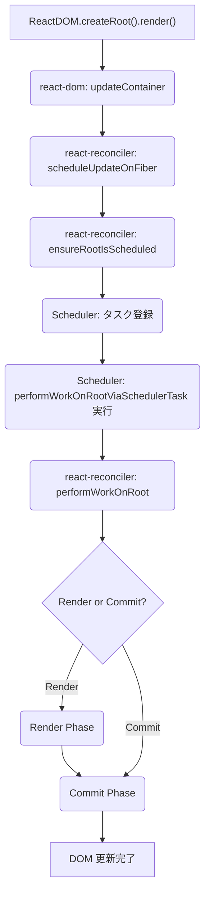

# 学習ログ: React 初期レンダリングプロセス

## 調査日

2025/3/29

## 目的

`ReactDOM.createRoot().render(<App />)` が呼び出されてから、画面に要素が表示されるまでの React 内部の処理フローを理解する。

## 全体フロー図



## 調査結果概要

React の初期レンダリングは、大きく分けて **Render フェーズ** と **Commit フェーズ** の2段階で実行される。

1.  **エントリーポイント (`react-dom`)**:
    *   `ReactDOM.createRoot(container)` (`packages/react-dom/src/client/ReactDOMRoot.js:165`) が呼び出される。
    *   内部で `createContainer` (`packages/react-reconciler/src/ReactFiberReconciler.js:198`) を呼び出し、`FiberRoot` (アプリケーション全体の管理オブジェクト) と `HostRoot` Fiber (Fiber ツリーのルート) を作成する。
    *   `root.render(element)` が呼び出される。
    *   内部で `updateContainer` (`packages/react-reconciler/src/ReactFiberReconciler.js:281`) を呼び出し、更新をスケジュールする (`scheduleUpdateOnFiber` (`packages/react-reconciler/src/ReactFiberWorkLoop.js:727`))。

2.  **スケジューリング (`react-reconciler`)**:
    *   `ensureRootIsScheduled` (`packages/react-reconciler/src/ReactFiberRootScheduler.js:103`) が Scheduler にレンダリングタスクを登録する。

3.  **Render フェーズ (`react-reconciler`)**:
    *   Scheduler が `performWorkOnRoot` (`packages/react-reconciler/src/ReactFiberWorkLoop.js:868`) を呼び出し、レンダリングループ (`workLoopSync`/`Concurrent`) を開始する。
    *   **`performUnitOfWork`** (`packages/react-reconciler/src/ReactFiberWorkLoop.js:1530`): 各 Fiber ノードを処理する単位。
        *   **`beginWork`** (`packages/react-reconciler/src/ReactFiberBeginWork.js:2188`): 現在の Fiber を処理し、子 Fiber を返す。 (ツリーを降りる)
            *   `HostRoot`: `updateHostRoot` (`packages/react-reconciler/src/ReactFiberBeginWork.js:1888`) を呼び出し、`reconcileChildren` (`packages/react-reconciler/src/ReactFiberBeginWork.js:318`) でルート要素 (`<App />`) の Fiber を作成/更新。
            *   `FunctionComponent`: `updateFunctionComponent` (`packages/react-reconciler/src/ReactFiberBeginWork.js:1701`) を呼び出し、`renderWithHooks` (`packages/react-reconciler/src/ReactFiberHooks.js:510`) で関数を実行し、`reconcileChildren` (`packages/react-reconciler/src/ReactFiberBeginWork.js:318`) で子要素を処理。
            *   (他のコンポーネントタイプも同様)
        *   **`completeUnitOfWork`** (`packages/react-reconciler/src/ReactFiberWorkLoop.js:1811`): 子の処理が終わった Fiber の処理を完了させる。(ツリーを登る)
            *   **`completeWork`** (`packages/react-reconciler/src/ReactFiberCompleteWork.js:1001`):
                *   `HostComponent`: DOM 要素を作成 (`createInstance`)、プロパティ設定 (`finalizeInitialChildren`)、子 DOM 追加 (`appendAllChildren`)。
                *   副作用フラグ (Placement, Update など) や子レーンを親に伝播 (`bubbleProperties`)。
    *   ツリー全体を `beginWork` (`packages/react-reconciler/src/ReactFiberBeginWork.js:2188`) で降り、`completeWork` (`packages/react-reconciler/src/ReactFiberCompleteWork.js:1001`) で登りながら処理し、`HostRoot` に完了した Fiber ツリー (`finishedWork`) と副作用フラグが集約される。

    ```mermaid
    graph TD
        Loop(Work Loop: workLoopSync/Concurrent) --> PUoW(performUnitOfWork);
        PUoW --> BW(beginWork);
        BW -- 子あり --> PUoW;
        BW -- 子なし --> CUoW["completeUnitOfWork (`packages/react-reconciler/src/ReactFiberWorkLoop.js:1811`)"];
        CUoW --> CompW["completeWork (`packages/react-reconciler/src/ReactFiberCompleteWork.js:1001`)"];
        CompW --> Parent{親へ};
        Parent -- 兄弟あり --> PUoW;
        Parent -- 兄弟なし --> CUoW;
        Parent -- ルート到達 --> EndLoop(Render Phase 完了);
    ```

4.  **Commit フェーズ (`react-reconciler`)**:
    *   `commitRoot` が呼び出され、`finishedWork` を元に実際の DOM 操作などを行う。
    *   **Before Mutation フェーズ (`commitBeforeMutationEffects`)**: DOM 変更前に `getSnapshotBeforeUpdate` などを実行。
    *   **Mutation フェーズ (`commitMutationEffects`)**:
        *   DOM の挿入/更新/削除 (`commitHostPlacement`, `commitHostUpdate`, `commitDeletionEffects`)。
        *   `useLayoutEffect` のクリーンアップ実行。
        *   `ref` のデタッチ。
        *   `root.current` を `finishedWork` に切り替え。
    *   **Layout フェーズ (`commitLayoutEffects`)**:
        *   `componentDidMount`/`Update`、`useLayoutEffect` 実行。
        *   `ref` のアタッチ。

    ```mermaid
    graph TD
        StartCommit(commitRoot) --> BeforeMutation(Before Mutation Phase);
        BeforeMutation --> Mutation(Mutation Phase);
        Mutation --> SwitchCurrent(root.current 切り替え);
        SwitchCurrent --> Layout(Layout Phase);
        Layout --> EndCommit(Commit Phase 完了);
        Layout --> Passive(Passive Effects フェーズへ続く);
    ```

5.  **Passive Effects フェーズ (`react-reconciler`)**:
    *   Commit フェーズ完了後、非同期に `flushPassiveEffects` が呼び出される。
    *   `useEffect` のクリーンアップ (`commitPassiveUnmountEffects`) と実行 (`commitPassiveMountEffects`)。

## 主要な関連ファイル

*   `packages/react-dom/src/client/ReactDOMClient.js`: `createRoot` (`packages/react-dom/src/client/ReactDOMRoot.js:165`) のエクスポート元。
*   `packages/react-dom/src/client/ReactDOMRoot.js`: `createRoot` (`packages/react-dom/src/client/ReactDOMRoot.js:165`), `root.render` の実装。`createContainer` (`packages/react-reconciler/src/ReactFiberReconciler.js:198`), `updateContainer` (`packages/react-reconciler/src/ReactFiberReconciler.js:281`) を呼び出す。
*   `packages/react-reconciler/src/ReactFiberReconciler.js`: `createContainer` (`packages/react-reconciler/src/ReactFiberReconciler.js:198`), `updateContainer` (`packages/react-reconciler/src/ReactFiberReconciler.js:281`) の実装。`createFiberRoot`, `scheduleUpdateOnFiber` (`packages/react-reconciler/src/ReactFiberWorkLoop.js:727`) を呼び出す。
*   `packages/react-reconciler/src/ReactFiberRoot.js`: `createFiberRoot` の実装。`FiberRootNode` と `HostRoot` Fiber を作成・接続。
*   `packages/react-reconciler/src/ReactFiber.js`: `FiberNode` データ構造、`createHostRootFiber`, `createFiber` などの実装。
*   `packages/react-reconciler/src/ReactFiberWorkLoop.js`: レンダリングループ (`performWorkOnRoot` (`packages/react-reconciler/src/ReactFiberWorkLoop.js:868`), `workLoopSync`, `performUnitOfWork` (`packages/react-reconciler/src/ReactFiberWorkLoop.js:1530`))、Commit フェーズの起点 (`commitRoot`)。
*   `packages/react-reconciler/src/ReactFiberRootScheduler.js`: `ensureRootIsScheduled` (`packages/react-reconciler/src/ReactFiberRootScheduler.js:103`) の実装。Scheduler との連携。
*   `packages/react-reconciler/src/ReactFiberBeginWork.js`: `beginWork` (`packages/react-reconciler/src/ReactFiberBeginWork.js:2188`) の実装。Fiber タイプに応じた処理分岐。
*   `packages/react-reconciler/src/ReactChildFiber.js`: `reconcileChildren` (`packages/react-reconciler/src/ReactFiberBeginWork.js:318`) の実装。子要素の差分検出アルゴリズム。
*   `packages/react-reconciler/src/ReactFiberCompleteWork.js`: `completeWork` (`packages/react-reconciler/src/ReactFiberCompleteWork.js:1001`) の実装。DOM 要素作成準備、副作用フラグ集約。
*   `packages/react-reconciler/src/ReactFiberCommitWork.js`: Commit フェーズの各サブフェーズ (`commitMutationEffects`, `commitLayoutEffects` など) の実装。

## 今後の学習ポイント

*   `beginWork` の各コンポーネントタイプごとの詳細な処理。
*   `completeWork` での DOM 要素作成とプロパティ設定の詳細 (`react-dom-bindings` との連携)。
*   `commitMutationEffects` での具体的な DOM 操作 (`react-dom-bindings` との連携)。
*   ライフサイクルメソッドや Effect フックが Commit フェーズのどのタイミングで実行されるか。
*   Lane モデルとスケジューリングの詳細。
