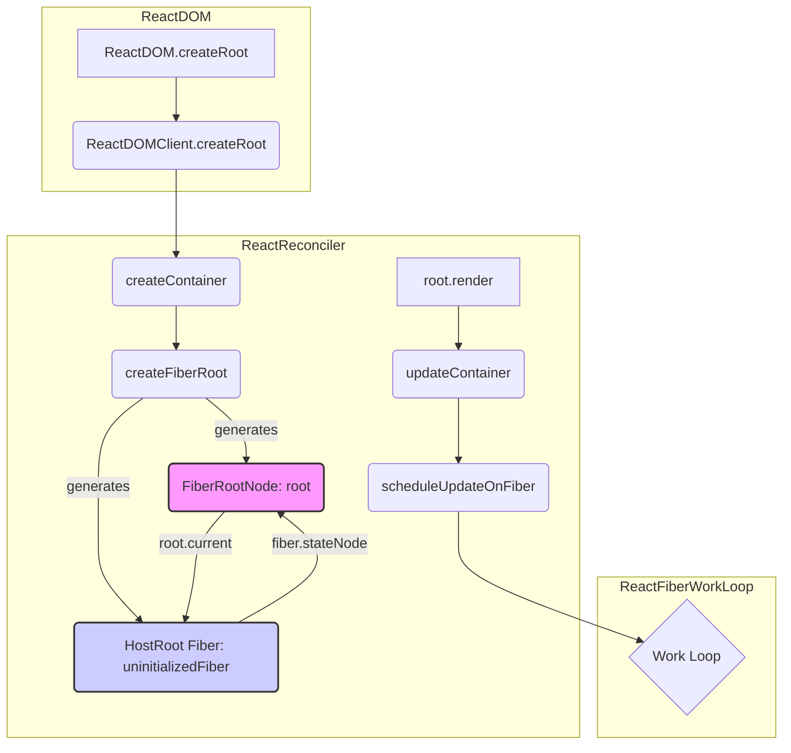

# `createRoot` 関数の内部実装分析

## 1. 概要

`ReactDOM.createRoot(container).render(<App />)` の呼び出しから、React アプリケーションの初期レンダリングがどのように開始されるかを追跡・分析する。

## 2. 関連ファイル

*   `packages/react-dom/src/client/ReactDOMRoot.js`
*   `packages/react-dom/src/client/ReactDOMClient.js`
*   `packages/react-reconciler/src/ReactFiberReconciler.js`
*   `packages/react-reconciler/src/ReactFiberRoot.js`
*   `packages/react-reconciler/src/ReactFiber.js`
*   `packages/react-reconciler/src/ReactFiberWorkLoop.js`

## 3. 分析ログ

### 3.1. `createRoot` の呼び出しフロー

1.  **`createRoot` (`ReactDOMRoot.js:165`)**:
    *   内部で `ReactDOMClient.js` の `createRoot` を呼び出す。
    *   `isStrictMode` や `identifierPrefix` などのオプションを処理。
    *   `createContainer` (`ReactFiberReconciler.js:280`) を呼び出して `FiberRoot` を作成。
    *   `listenToAllSupportedEvents` (`ReactDOMComponentTree.js`) でイベントリスナーをコンテナに設定。
    *   `ReactDOMRoot` オブジェクトを生成して返す。このオブジェクトが `render` メソッドを持つ。

2.  **`createContainer` (`ReactFiberReconciler.js:280`)**:
    *   `createFiberRoot` (`ReactFiberRoot.js:165`) を呼び出して `FiberRootNode` と `HostRootFiber` を作成・初期化する。

3.  **`createFiberRoot` (`ReactFiberRoot.js:165`)**:
    *   `FiberRootNode` コンストラクタ (`ReactFiberRoot.js:48`) を呼び出して `root` オブジェクトを生成。
        *   `containerInfo`, `tag` (通常 `ConcurrentRoot`), エラーハンドラなどを設定。
        *   `pendingLanes`, `suspendedLanes` などの更新管理用プロパティを初期化。
    *   `createHostRootFiber` (`ReactFiber.js:418`) を呼び出して `HostRoot` タグを持つ `FiberNode` (`uninitializedFiber`) を生成。
    *   **循環参照の設定:**
        *   `root.current = uninitializedFiber;` (`FiberRoot` -> `HostRoot Fiber`)
        *   `uninitializedFiber.stateNode = root;` (`HostRoot Fiber` -> `FiberRoot`)
    *   **キャッシュ初期化 (`ReactFiberCacheComponent.js` 関連):**
        *   `createCache()` (`L59`) で新しいキャッシュオブジェクト (`initialCache`) を生成。
            *   `Cache` オブジェクトは `{ controller: AbortController, data: Map, refCount: number }` という構造を持つ。
            *   `controller` は非同期処理中断用、`data` は `use` フック等でのデータ格納用、`refCount` は参照カウントによるライフサイクル管理用。
            *   生成時の `refCount` は `0`。
        *   `retainCache(initialCache)` (`L68`) を呼び出し、参照カウントをインクリメント (`refCount: 1`)。これは主に `HostRoot Fiber` の `memoizedState.cache` (後述) で保持されるため。
            *   `retainCache` / `releaseCache` (`L79`) により参照カウントを管理し、`refCount` が 0 になると `releaseCache` が非同期で `controller.abort()` を呼び出し、リソース解放を試みる。
        *   `root.pooledCache = initialCache;`: レンダリング中に **新しくマウントされるコンポーネント (特に Suspense Boundary)** が一時的に使用する `pooledCache` にも同じキャッシュ (`initialCache`) を設定。
        *   `retainCache(initialCache)` を再度呼び出し、参照カウントをインクリメント (`refCount: 2`)。`pooledCache` からも参照されるため。
    *   **初期状態設定:**
        *   `HostRoot Fiber` (`uninitializedFiber`) の `memoizedState` に `RootState` オブジェクト (`ReactFiberRoot.js:33`) を設定。
        *   `RootState` は `{ element: any, isDehydrated: boolean, cache: Cache }` という構造を持つ。
        *   `element` には `initialChildren` (レンダリング対象)、`isDehydrated` には `hydrate` フラグ、`cache` には先ほど作成・retain した `initialCache` が設定される。
        *   この `memoizedState` は Render フェーズ (`updateHostRoot`) での処理の基点となる。
    *   **更新キュー初期化:**
        *   `initializeUpdateQueue(uninitializedFiber)` (`ReactFiberClassUpdateQueue.js:162`) を呼び出す。
        *   `HostRoot Fiber` の `updateQueue` プロパティに `UpdateQueue` オブジェクトを生成・設定する。
        *   `UpdateQueue` は以下の構造を持つ:
            *   `baseState`: Fiber の現在の状態 (`uninitializedFiber.memoizedState` が初期値)。
            *   `firstBaseUpdate`/`lastBaseUpdate`: 処理済みの更新リスト (最初は `null`)。
            *   `shared`: `current` と `workInProgress` で共有されるキュー。
                *   `pending`: 未処理の更新リスト (最初は `null`)。ここに新しい更新が追加される。
                *   `lanes`: キュー内の更新レーン (最初は `NoLanes`)。
            *   `callbacks`: 更新完了後のコールバックリスト (最初は `null`)。
        *   これにより、`HostRoot Fiber` は更新を受け付ける準備が整う。
    *   `root` (`FiberRootNode`) を返す。

4.  **`createRoot` の後処理 (`ReactDOMRoot.js:181-191`)**:
    *   **コンテナのマーキング:** `markContainerAsRoot(root.current, container)` (`ReactDOMComponentTree.js`) を呼び出し、DOM コンテナが React ルートとして管理されていることを内部的にマークする。これにより、同じコンテナへの重複した `createRoot` 呼び出しなどを警告できる。
    *   **イベントリスナー設定:** `listenToAllSupportedEvents(rootContainerElement)` (`DOMPluginEventSystem.js`) を呼び出し、ルートコンテナ要素に React がサポートする全イベントに対するリスナーを一括登録する (イベント委任)。
    *   **`ReactDOMRoot` オブジェクト生成:** `new ReactDOMRoot(root)` で、`FiberRoot` を内部プロパティ (`_internalRoot`) として持つ `ReactDOMRoot` インスタンスを生成して返す。

5.  **`root.render(children)` (`ReactDOMRoot.js:96`)**:
    *   `updateContainer` (`ReactFiberReconciler.js:294`) を呼び出して、レンダリングを開始する。
    *   `children` (例: `<App />`) を `FiberRoot` に渡す。

5.  **`updateContainer` (`ReactFiberReconciler.js:294`)**:
    *   現在の Fiber (`current`)、イベント時間 (`eventTime`)、レーン (`lane`) を取得。
    *   コンテキストを更新。
    *   `scheduleUpdateOnFiber` (`ReactFiberWorkLoop.js:408`) を呼び出して、更新をスケジュールする。

### 3.2. `ReactDOMRoot` オブジェクトと `render` メソッド

*   **`ReactDOMRoot` (`ReactDOMRoot.js:91`)**: `createRoot` が最終的に返すオブジェクト。内部に `FiberRoot` (`_internalRoot`) を保持する。
*   **`render(children)` メソッド (`ReactDOMRoot.js:96`)**: ユーザーがレンダリングを開始/更新するために呼び出すメソッド。
    *   内部で `_internalRoot` (FiberRoot) を取得する。
    *   `updateContainer(children, root, null, null)` (`ReactFiberReconciler.js:294`) を呼び出す。これが React の更新プロセスの起点となる。

### 3.3. `FiberRoot` と `HostRoot Fiber`

*   **`FiberRootNode` (`ReactFiberRoot.js:48`)**:
    *   React アプリケーション全体のコンテナに対応するルートオブジェクト。
    *   アプリケーション全体の更新状態 (`pendingLanes`, `suspendedLanes` など)、コンテキスト、エラーハンドラ、現在の Fiber ツリー (`current` プロパティ) などを管理する。
*   **`FiberNode` (`ReactFiber.js:128`)**:
    *   個々のコンポーネントや DOM 要素に対応する作業単位。
    *   `tag` (種類)、`key`、`type` (コンポーネント/要素タイプ)、`stateNode` (インスタンス)、親子兄弟関係 (`return`, `child`, `sibling`)、`pendingProps`, `memoizedProps`, `memoizedState`, `updateQueue` などを保持する。
*   **`HostRoot Fiber`**:
    *   `FiberNode` の一種で、`tag` が `HostRoot`。
    *   Fiber ツリー全体のルートとなる特別な Fiber。
    *   `stateNode` プロパティは、他の `HostComponent` と異なり、対応する DOM 要素ではなく、**`FiberRootNode`** を指す。
    *   `memoizedState` には、レンダリング対象の初期要素 (`element`) やハイドレーション状態 (`isDehydrated`) を含む `RootState` オブジェクトが格納される。

### 3.3. `ReactDOMRoot` オブジェクトと `render` メソッド

*   **`ReactDOMRoot` (`ReactDOMRoot.js:91`)**: `createRoot` が最終的に返すオブジェクト。内部に `FiberRoot` (`_internalRoot`) を保持する。
*   **`render(children)` メソッド (`ReactDOMRoot.js:96`)**: ユーザーがレンダリングを開始/更新するために呼び出すメソッド。
    *   内部で `_internalRoot` (FiberRoot) を取得する。
    *   `updateContainer(children, root, null, null)` (`ReactFiberReconciler.js:294`) を呼び出す。これが React の更新プロセスの起点となる。

### 3.4. `FiberRoot` と `HostRoot Fiber`

*   **`FiberRootNode` (`ReactFiberRoot.js:48`)**:
    *   React アプリケーション全体のコンテナに対応するルートオブジェクト。
    *   アプリケーション全体の更新状態 (`pendingLanes`, `suspendedLanes` など)、コンテキスト、エラーハンドラ、現在の Fiber ツリー (`current` プロパティ)、**一時キャッシュプール (`pooledCache`)** などを管理する。
*   **`FiberNode` (`ReactFiber.js:128`)**:
    *   個々のコンポーネントや DOM 要素に対応する作業単位。
    *   `tag` (種類)、`key`、`type` (コンポーネント/要素タイプ)、`stateNode` (インスタンス)、親子兄弟関係 (`return`, `child`, `sibling`)、`pendingProps`, `memoizedProps`, `memoizedState`, `updateQueue` などを保持する。
*   **`HostRoot Fiber`**:
    *   `FiberNode` の一種で、`tag` が `HostRoot`。
    *   Fiber ツリー全体のルートとなる特別な Fiber。
    *   `stateNode` プロパティは、他の `HostComponent` と異なり、対応する DOM 要素ではなく、**`FiberRootNode`** を指す。
    *   `memoizedState` には、レンダリング対象の初期要素 (`element`) やハイドレーション状態 (`isDehydrated`)、**ルートのデフォルトキャッシュ (`cache`)** を含む `RootState` オブジェクトが格納される。

### 3.5. 循環参照 (`FiberRoot` <-> `HostRoot Fiber`) の理由考察

`createFiberRoot` 関数内で、`FiberRootNode` (`root`) と `HostRoot Fiber` (`uninitializedFiber`) の間に以下の相互参照が設定される。

1.  `root.current = uninitializedFiber;`
2.  `uninitializedFiber.stateNode = root;`

この循環参照が必要な理由は以下のように考えられる。

*   **関心の分離と連携:**
    *   `FiberRoot` はアプリケーション全体の **管理** (更新スケジューリング、エラー処理、コンテキストなど) を担当する。
    *   `HostRoot Fiber` は Fiber ツリーという **UI 構造** のルートを表す。
    *   この二つは密接に連携する必要がある。`FiberRoot` は作業を開始する対象 (`current` ツリー) を知る必要があり、ツリーの処理中には `FiberRoot` が持つ管理機能 (例: 更新キューへのアクセス) が必要になる。
*   **双方向からの効率的なアクセス:**
    *   **`FiberRoot` -> `HostRoot Fiber`:** `FiberRoot` は `current` プロパティを通じて、現在アクティブな Fiber ツリーのルートにアクセスし、更新処理を開始できる。
    *   **`HostRoot Fiber` -> `FiberRoot`:** Fiber ツリーのルート (`HostRoot Fiber`) は `stateNode` プロパティを通じて、自身を管理する `FiberRoot` にアクセスできる。これにより、ツリーの深い階層からでも `return` ポインタを辿ってルートまで行き、そこから `FiberRoot` の機能 (例: `scheduleUpdateOnFiber` での更新キューへのアクセス) を利用できる。`FiberRoot` を Reconciler の関数間で引き回す必要がなくなる。

この循環参照は、React の更新プロセスにおいて、アプリケーション全体の管理と UI 構造の間の効率的かつ明確な連携を実現するための重要な設計パターンであると言える。（詳細な理由は今後のレンダリングループ分析で明らかになる可能性があるため、一旦保留）

## 4. 図解

### 4.1. キャッシュの種類 (`memoizedState.cache` vs `pooledCache`)

`createFiberRoot` では `initialCache` が生成され、`HostRootFiber.memoizedState.cache` と `FiberRootNode.pooledCache` の両方に設定されるが、それぞれの役割は異なる。

*   **`HostRootFiber.memoizedState.cache`**:
    *   **役割:** コミットされた (現在表示されている) UI ツリーの **デフォルトキャッシュコンテキスト** を提供する。`<Cache>` コンポーネントなどで明示的に指定されない限り、コンポーネントはこのキャッシュを利用する。
    *   **ライフサイクル:** `current` Fiber ツリーと連動する (比較的長い)。
*   **`FiberRootNode.pooledCache`**:
    *   **役割:** **現在進行中のレンダリングサイクル** において、**新しくマウントされるコンポーネント** (特に Suspense Boundary) が **一時的に** 利用するためのキャッシュプール。同じレンダリング内で複数の新規コンポーネントがキャッシュを共有できるようにする。
    *   **ライフサイクル:** 単一のレンダリングサイクルに限定される (一時的)。
        *   レンダリングが **コミット** されると、通常は解放される (`releaseCache`)。
        *   レンダリングが **中断 (suspend)** されると、中断したコンポーネントが内部的に `Offscreen` コンポーネントでラップされている場合、この `pooledCache` は Offscreen に **移動** され、レンダリング再開時に **再利用** されることがある。

### 4.2. 補足: Offscreenコンポーネントとキャッシュ

*   `<Offscreen>` は安定版の公開 API ではないが、React の **内部実装** として `Suspense` や `SuspenseList` などの機能を実現するために利用されている。
*   `Suspense` がフォールバックを表示する際、プライマリコンテンツは内部的に `mode="hidden"` の `Offscreen` でラップされ、状態やキャッシュが保持される。
*   レンダリングが中断された際の `pooledCache` は、この内部的な `Offscreen` コンポーネントの `memoizedState.cachePool` に移動され、再開時に再利用される可能性がある。このため、`pooledCache` の挙動を理解する上で `Offscreen` の内部的な役割を知ることが役立つ。

## 5. まとめ

`ReactDOM.createRoot(container)` は以下の処理を行う。

1.  `createContainer` を呼び出し、内部で `createFiberRoot` を実行。
2.  `FiberRootNode` と `HostRoot Fiber` を生成し、相互参照を設定。
3.  キャッシュ、初期状態 (`memoizedState`)、更新キュー (`updateQueue`) を `HostRoot Fiber` に初期化。
4.  DOM コンテナを React ルートとしてマーク (`markContainerAsRoot`)。
5.  ルートコンテナにイベントリスナーを設定 (`listenToAllSupportedEvents`)。
6.  `FiberRoot` を内包する `ReactDOMRoot` オブジェクトを返す。

ユーザーが返された `root` オブジェクトの `render(children)` メソッドを呼び出すと、`updateContainer` が実行され、`scheduleUpdateOnFiber` を通じて更新プロセスが開始される。

## 6. 次のステップ

*   `scheduleUpdateOnFiber` から始まるスケジューリングとレンダリングループの詳細を `learning-log/01_initial_rendering/03_scheduling_and_workloop.md` で分析する。
*   (後回し) `FiberRoot` と `HostRoot Fiber` の循環参照の必要性について、レンダリングループの分析を踏まえて再度考察する。
