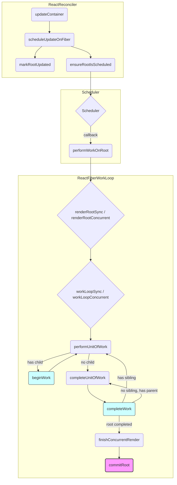

# スケジューリングとレンダリングループの分析

`updateContainer` から呼び出される `scheduleUpdateOnFiber` (`ReactFiberWorkLoop.js:408`) は、更新をスケジューリングする起点となる。

1.  **ルート更新マーク:** `markRootUpdated(root, lane)` でルートに更新があることを記録。
2.  **スケジューリング確保:** `ensureRootIsScheduled(root)` で Scheduler にコールバックを登録し、作業実行を保証。
3.  **レンダリングループ呼び出し:** Scheduler は適切なタイミングで `performWorkOnRoot` (`ReactFiberWorkLoop.js:518`) を呼び出す。
4.  **同期/非同期ループ選択:** `performWorkOnRoot` は、レーンや状態に応じて `renderRootSync` (`ReactFiberWorkLoop.js:1408`) または `renderRootConcurrent` (`ReactFiberWorkLoop.js:1528`) を選択。
5.  **作業ループ実行:**
    *   `renderRootSync` -> `workLoopSync` (`ReactFiberWorkLoop.js:1510`) を実行。中断なし。
    *   `renderRootConcurrent` -> `workLoopConcurrent` (`ReactFiberWorkLoop.js:1700`) または `workLoopConcurrentByScheduler` (`ReactFiberWorkLoop.js:1712`) を実行。`shouldYield()` を確認し、中断・再開可能。
6.  **作業単位処理:**
    *   `workLoopSync`/`workLoopConcurrent` は `performUnitOfWork` (`ReactFiberWorkLoop.js:1720`) を繰り返し呼び出す。
    *   `performUnitOfWork` は `beginWork` (`ReactFiberBeginWork.js`) を呼び出し、子 Fiber を生成 (下降)。
    *   子がない場合、`completeUnitOfWork` (`ReactFiberWorkLoop.js:1910`) を呼び出す。
    *   `completeUnitOfWork` は `completeWork` (`ReactFiberCompleteWork.js`) を呼び出し、副作用を準備 (上昇)。兄弟または親へ移動。
7.  **完了/中断/エラー:** ループは Fiber ツリー全体の処理が完了するか、中断されるか、エラーが発生するまで続く。
8.  **コミット:** ループ完了後、`finishConcurrentRender` (`ReactFiberWorkLoop.js:900`) -> `commitRoot` (`ReactFiberWorkLoop.js:1960`) が呼び出され、実際の DOM 更新などが行われる (Commit フェーズ)。

## 1. `beginWork` の分析 (`ReactFiberBeginWork.js`)

`performUnitOfWork` から呼び出される `beginWork` (L2118) は、Fiber の種類 (`tag`) に応じて処理を分岐し、子 Fiber の生成 (Reconciliation) を行います。

### 1.1. `HostRoot` の場合 (`updateHostRoot`, L1061)

1.  **コンテキスト設定:** `pushHostRootContext`, `pushRootTransition`, `pushCacheProvider` などでルート固有のコンテキストをスタックに積む。
2.  **更新処理:** `processUpdateQueue` で `root.render()` から渡された要素 (`element`) を含む `RootState` を `memoizedState` に設定する。
3.  **ハイドレーション (該当する場合):** `memoizedState.isDehydrated` が `true` なら、`enterHydrationState` を呼び出し、`mountChildFibers` で子要素のハイドレーションを試みる。
4.  **子要素の Reconcile:** `reconcileChildren` を呼び出し、`memoizedState.element` に基づいて子 Fiber を生成する。
5.  最初の子 Fiber を返す。

### 1.2. `FunctionComponent` の場合 (`updateFunctionComponent`, L800)

1.  **コンテキスト準備:** `prepareToReadContext` でコンテキスト読み取りの準備。
2.  **Hooks 実行:** `renderWithHooks` を呼び出し、関数コンポーネント本体を実行し、Hooks を処理する。戻り値はコンポーネントがレンダリングする子要素 (`nextChildren`)。
3.  **Bailout:** `current` が存在し、props/context の変更や更新がない場合、`bailoutHooks` と `bailoutOnAlreadyFinishedWork` で処理をスキップする最適化を行う。
4.  **子要素の Reconcile:** `reconcileChildren` を呼び出し、`renderWithHooks` の結果 (`nextChildren`) に基づいて子 Fiber を生成する。
5.  最初の子 Fiber を返す。

`beginWork` はこのように、Fiber の状態を更新し、コンポーネントロジックを実行し、子要素との差分比較 (Reconciliation) を開始することで、Work-in-progress ツリーを下降的に構築していく役割を担います。

## 2. `completeWork` の分析 (`ReactFiberCompleteWork.js`)

`completeUnitOfWork` から呼び出される `completeWork` (L1008) は、Render フェーズの上昇処理を担当します。子要素の処理が完了した後、または子要素がない場合に呼び出され、現在の Fiber (`workInProgress`) の処理を完了させます。

### 2.1. 主な役割

1.  **DOM ノード生成/更新準備:**
    *   **`HostComponent` (例: `
`)**:
        *   初回マウント時: `createInstance` で DOM 要素を生成し `stateNode` に格納。`appendAllChildren` で子 DOM を追加。`finalizeInitialChildren` で属性等を設定。`Placement` フラグ付与。
        *   更新時: `updateHostComponent` (L368) で props を比較し、変更があれば `Update` フラグ付与。
    *   **`HostText`**:
        *   初回マウント時: `createTextInstance` でテキストノードを生成し `stateNode` に格納。`Placement` フラグ付与。
        *   更新時: `updateHostText` (L618) でテキスト内容を比較し、変更があれば `Update` フラグ付与。
2.  **副作用フラグとレーンの集約 (Bubbling):**
    *   `bubbleProperties` (L718) を呼び出し、子孫の `subtreeFlags` と `childLanes` を現在の Fiber の `subtreeFlags` と `childLanes` にマージする。これにより、Commit フェーズでの効率的な処理が可能になる。
3.  **コンテキストのポップ:**
    *   `beginWork` でプッシュされた各種コンテキスト (`HostContext`, `SuspenseContext`, `Provider` など) を対応する `pop` 関数でスタックから取り除く。
4.  **Suspense 処理:**
    *   `SuspenseComponent`: ハイドレーション状態の完了処理 (`completeDehydratedSuspenseBoundary`, L810)、フォールバック状態の確定、リトライ処理のスケジュール (`scheduleRetryEffect`, L580)、Visibility フラグの管理などを行う。
5.  **その他 Fiber タイプ:**
    *   `HostRoot`: `updateHostContainer` (L334) でコンテナ更新、コンテキストポップ。
    *   `FunctionComponent`, `ClassComponent` など: `bubbleProperties` によるフラグ/レーン集約が主。クラスコンポーネントではレガシーコンテキストのポップも行う。

`completeWork` は、`beginWork` で開始された作業を完了させ、DOM 操作の準備を整え、副作用情報を親 Fiber へ伝播させることで、Commit フェーズへの橋渡しを行います。

## 3. Commit フェーズの分析 (`commitRoot` in `ReactFiberWorkLoop.js`)

Render フェーズが完了すると、`finishConcurrentRender` (L900) を経て `commitRoot` (L1960) が呼び出され、Commit フェーズが開始されます。`commitRoot` は副作用を適用する全体の流れを制御します。

1.  **準備:**
    *   保留中の Passive Effect をフラッシュ (`flushPendingEffects`)。
    *   `executionContext` を `CommitContext` に設定。
    *   完了した Fiber ツリー (`finishedWork`) や関連情報をモジュール変数 (`pendingFinishedWork` など) に保存。
    *   ルートの状態を更新 (`markRootFinished`)。

2.  **サブフェーズの実行:**
    *   **Before Mutation フェーズ:**
        *   `commitBeforeMutationEffects` (`ReactFiberCommitWork.js`) を呼び出す。
        *   DOM 変更前に `getSnapshotBeforeUpdate` を実行。
    *   **Mutation フェーズ:**
        *   `flushMutationEffects` (L2118) -> `commitMutationEffects` (`ReactFiberCommitWork.js`) を呼び出す。
        *   DOM の挿入・更新・削除を実行。
        *   `root.current = finishedWork;` を実行し、**finishedWork ツリーを current ツリーに切り替える**。
    *   **Layout フェーズ:**
        *   `flushLayoutEffects` (L2151) -> `commitLayoutEffects` (`ReactFiberCommitWork.js`) を呼び出す。
        *   DOM 変更後に `useLayoutEffect` の実行、`componentDidMount`/`Update` の呼び出し。
    *   **後処理 & Passive Effect スケジュール:**
        *   `flushSpawnedWork` (L2184) を呼び出す。
        *   `requestPaint()` でブラウザ描画を促す。
        *   Passive Effect があれば (`PassiveMask` フラグ確認)、`flushPassiveEffects` を非同期 (通常) または同期 (SyncLane の場合など) でスケジュールする。
        *   回復可能エラーのログ出力、DevTools への通知など。
        *   `ensureRootIsScheduled` で次の作業をスケジュール。

3.  **Passive Effect フェーズ (非同期 or 同期フラッシュ):**
    *   `flushPassiveEffects` (L2310) -> `flushPassiveEffectsImpl` (L2339) が実行される。
    *   `commitPassiveUnmountEffects` (`ReactFiberCommitWork.js`): 前回の `useEffect` のクリーンアップ関数を実行。
    *   `commitPassiveMountEffects` (`ReactFiberCommitWork.js`): 今回の `useEffect` の実行関数を実行。

`commitRoot` はこれらのサブフェーズを順番に実行し、Render フェーズで決定された変更を実際の環境に適用します。

## 4. Commit フェーズのサブフェーズ詳細 (`ReactFiberCommitWork.js`)

`commitRoot` は Commit フェーズの各サブフェーズに対応する関数を呼び出す。これらの関数の多くは `ReactFiberCommitWork.js` に実装されている。

### 4.1. Before Mutation フェーズ (`commitBeforeMutationEffects`, L100)

*   **目的:** DOM 変更 *直前* の状態読み取り (`getSnapshotBeforeUpdate`)。
*   **処理:** `commitBeforeMutationEffectsOnFiber` (L138) を実行。
    *   `ClassComponent` (`Snapshot` フラグ): `commitClassSnapshot` (L224) -> `getSnapshotBeforeUpdate` 実行。
    *   `HostRoot` (`Snapshot` フラグ): コンテナクリア (`clearContainer`)。
    *   フォーカス管理 (`beforeActiveInstanceBlur`, L92)。
    *   View Transition 準備。

### 4.2. Mutation フェーズ (`commitMutationEffects`, L1118)

*   **目的:** 実際の DOM 変更 (挿入、更新、削除)。**`root.current` の切り替え**。
*   **処理:** `commitMutationEffectsOnFiber` (L1150) を実行。
    *   **Deletion:** `commitDeletionEffects` (L718) -> `commitDeletionEffectsOnFiber` (L751)
        *   Ref 解除 (`safelyDetachRef`, L218)。
        *   `componentWillUnmount` 実行 (`safelyCallComponentWillUnmount`, L221)。
        *   `useLayoutEffect` クリーンアップ (`commitHookEffectListUnmount`, L248)。
        *   DOM ノード削除 (`commitHostRemoveChild` など)。
        *   Fiber の `return` 切断 (`detachFiberMutation`, L698)。
    *   **Placement:** DOM ノード挿入/移動 (`commitHostPlacement`)。
    *   **Update:** DOM 属性/テキスト更新 (`commitHostUpdate`, `commitHostTextUpdate`)。
    *   **ContentReset:** テキストクリア (`commitHostResetTextContent`)。
    *   **Ref (更新時):** 古い Ref 解除 (`safelyDetachRef`)。

### 4.3. Layout フェーズ (`commitLayoutEffects`, L1400)

*   **目的:** DOM 変更 *完了後* の DOM 読み取り、レイアウト依存の副作用 (`useLayoutEffect`)、ライフサイクル実行。
*   **処理:** `commitLayoutEffectOnFiber` (L104) を実行。
    *   `FunctionComponent`: `useLayoutEffect` 実行 (`commitHookLayoutEffects`, L200)。
    *   `ClassComponent`: `componentDidMount`/`Update` 実行 (`commitClassLayoutLifecycles`, L206)、`setState` コールバック実行 (`commitClassCallbacks`, L212)。
    *   Ref 接続 (`safelyAttachRef`, L218)。
    *   `HostComponent`: 初回マウント処理 (`commitHostMount`, L224)。

### 4.4. Passive Effect フェーズ (`flushPassiveEffects` in `ReactFiberWorkLoop.js`)

*   **目的:** DOM 変更/レイアウト非依存の副作用 (`useEffect`)。通常は非同期実行。
*   **処理:** `flushPassiveEffectsImpl` (L2339) を実行。
    *   **Unmount:** `commitPassiveUnmountEffects` (L1868) -> `commitPassiveUnmountOnFiber` (L1910)
        *   前回の `useEffect` クリーンアップ実行 (`commitHookPassiveUnmountEffects`, L248)。
        *   Offscreen 非表示時のエフェクト切断 (`disconnectPassiveEffect`, L1960)。
    *   **Mount:** `commitPassiveMountEffects` (L1618) -> `commitPassiveMountOnFiber` (L1660)
        *   今回の `useEffect` 実行 (`commitHookPassiveMountEffects`, L242)。
        *   Offscreen 表示時のエフェクト再接続 (`reconnectPassiveEffects`, L1518)。
        *   キャッシュ管理 (`commitCachePassiveMountEffect` など)。

Commit フェーズは、これらの段階的な処理を通じて、安全かつ効率的に UI の変更を適用し、関連する副作用を実行する。

## 5. まとめと次のステップ

(このファイルではスケジューリングとレンダリングループ、およびそれに続く Render/Commit フェーズの分析を行う)

**次の学習テーマ案:**

*   **Hooks の内部実装:** `useState`, `useEffect` が Render/Commit フェーズでどのように処理されるか (`ReactFiberHooks.js`)。
*   **イベントシステム:** React の合成イベントがどのように発火・伝播するか (`react-dom-bindings/src/events/`)。
*   **更新プロセス:** `setState` や `dispatch` がどのように更新をトリガーし、レーンモデルや Scheduler と連携するか。

どれから進めますか？
